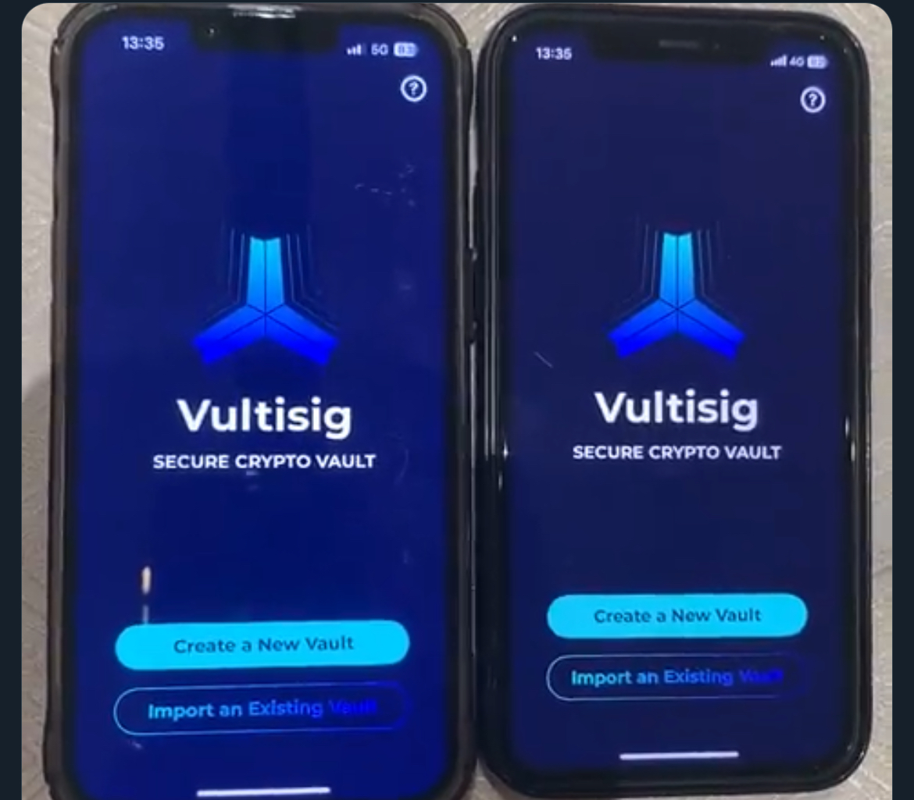

# Create a Vultisig Fast or Secure Vault

Think of the vault as a safe that needs a threshold of keys to open. Fast Vault: your device plus VultiServer. Secure Vault: devices you hold.

***

## Vault types


iOS, macOS, Android, Windows, Linux, Chrome, and Firefox can create vaults. Downloads: [vultisig.com](https://vultisig.com/).


<table data-card-size="large" data-view="cards"><thead><tr><th></th><th></th><th data-hidden data-card-target data-type="content-ref"></th></tr></thead><tbody><tr><td><strong>Fast Vault</strong></td><td>One device + VultiServer (2-of-2). VultiServer co-signs and can never sign alone.</td><td><a href="fast-vault.md">fast-vault.md</a></td></tr><tr><td><strong>Secure Vault</strong></td><td>Two or more devices you control. 2-of-3 is the usual setup.</td><td><a href="secure-vault.md">secure-vault.md</a></td></tr></tbody></table>

<figure><figcaption></figcaption></figure>

***

## Video Guides

**Creating a Fast Vault:**

**Creating a 2-of-2 Secure Vault:**

**Creating a 3-of-4 Secure Vault:**

***

## After Creation


**Export a backup before you deposit.**

A lost device with no backup means the funds are gone. See [Backup & Recovery](../../getting-started/backup-recovery.md).

