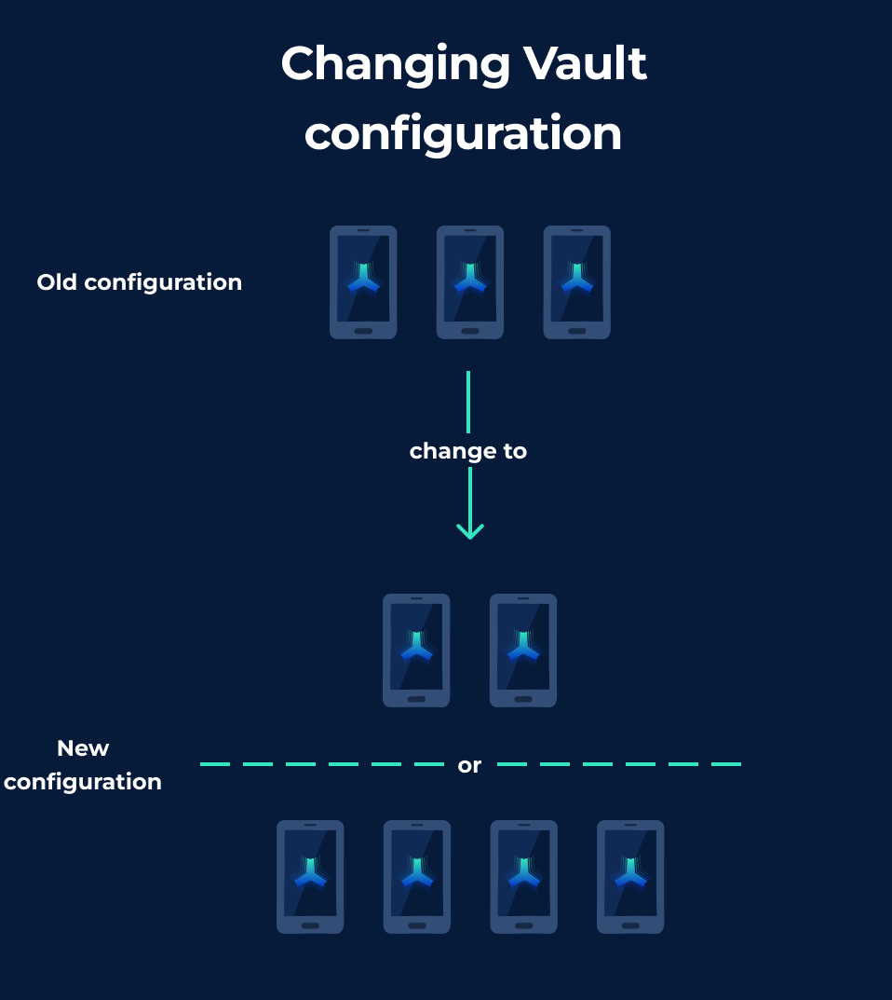

# Reshare a Vultisig vault


**Reshare carefully.** A mistake here can lock you out. Read the warnings at the bottom before you start.


<figure><figcaption>
Reshare in settings
</figcaption></figure>

***

## What is Resharing?

Reshare changes which devices hold shares. Addresses stay the same. Funds stay put.

You can:

- Add a device (for example 2-of-2 → 2-of-3)
- Remove a device you no longer want in the set
- Include Vultiserver in an existing Secure Vault
- Replace a lost device, if you still have the threshold

<figure><figcaption></figcaption></figure>

***

## Requirements


A threshold majority is **always** required. For a 2-of-3 vault, at least 2 devices must be present.


***

## Video Guides

**Resharing from 3-of-4 to 2-of-3:**

**Resharing from 2-of-2 to 2-of-3:**

***

## How to reshare

1. Go to **Settings** → **Vault Settings** → **Reshare**
2. Choose whether to include Vultiserver
3. Start the ceremony on one device
4. Join with the other devices (QR or relay)
5. Add the new device, or leave an old one out
6. Wait until every remaining device finishes

<figure><figcaption></figcaption></figure>

***

## Use Cases

### Adding Devices

Join additional devices during the reshare ceremony to increase security:
- 2-of-2 → 2-of-3 (adds backup device)
- 2-of-3 → 3-of-4 (increases threshold)

### Removing Devices

Exclude a device by not joining it in the ceremony:
- 3-of-4 → 2-of-3 (reduces complexity)
- Remove a compromised device

### Replacing Lost Devices

If a device is lost but you have threshold access:
1. Initiate reshare with remaining devices
2. Add the replacement device
3. Complete reshare to issue new shares

***

## Critical Warnings


**Export new backups as soon as reshare finishes.**

Every share changes. Old backups belong to the old set only. Do not mix the two.



Old vault shares can still sign with each other. Resharing does not invalidate the old set—it creates a new parallel set.


***

## Related

- [Vault Backup](vault-backup.md) - Essential after resharing
- [Vault Upgrade](vault-upgrade.md) - Change TSS protocol
