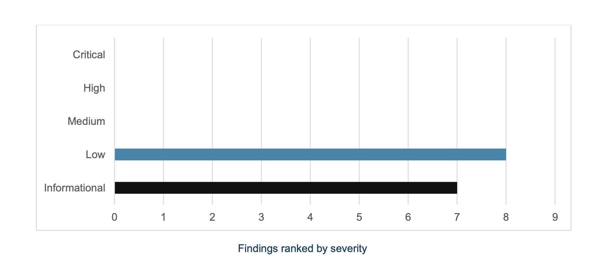

# Send crypto from Vultisig

You can send on every chain in the vault. Your devices sign together. No device holds the complete key.

***

## How to send

1. Select the asset you want to send
2. Tap **Send**
3. Enter the recipient — paste, scan a QR, or pick from the **address book**
4. On XRP, fill the **destination tag** if the receiver asks for one. A missing tag on an exchange deposit can be unrecoverable
5. Enter the amount. **Max** sends the full spendable balance after fees
6. Check destination, amount, network fee, and any decoded function
7. Sign with your devices
8. The app broadcasts after a successful signature

<figure><figcaption>
Send Flow
</figcaption></figure>

***

## Address book

Save a name and address in **Settings → Address book**, then pick it on send instead of pasting. The book lives on this app install. It is not a backup and it is not a vault share.

***

## XRP destination tags

Ripple (XRP) send shows a destination tag field. Exchanges and some custodians need that tag to credit your deposit. If they give you an X-address, the app can split it into the classic address and the tag.

***

## Blockaid

On by default. Turn it off under **Settings → Vault Settings → Advanced → On-chain security**. On send and on dApp / WalletConnect sign, the verify screen can warn you about a malicious destination or contract. It is a warning, not a lock. You still decide whether to sign. See [Settings](../settings.md).

***

## Tips

* Check the recipient address. Once it is on-chain, you cannot undo it
* Leave a little native token in the vault for the network fee
* Prefer a QR or the address book over typing
* For a large first send to a new address, send a small test first

***

## Related

* [Keysign](../../security-and-technology/keysign.md)
* [Swapping](swapping.md)
* [Wallet tab](README.md)
