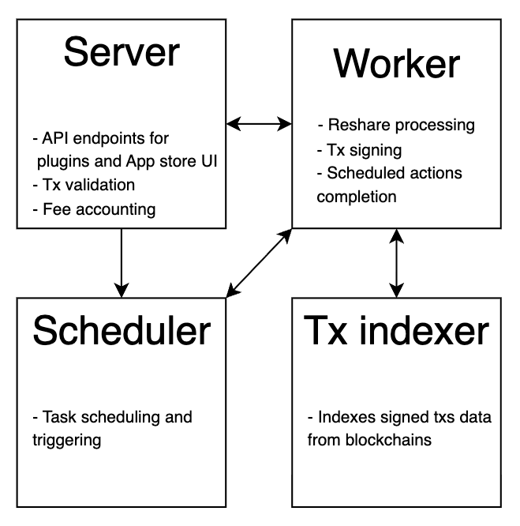
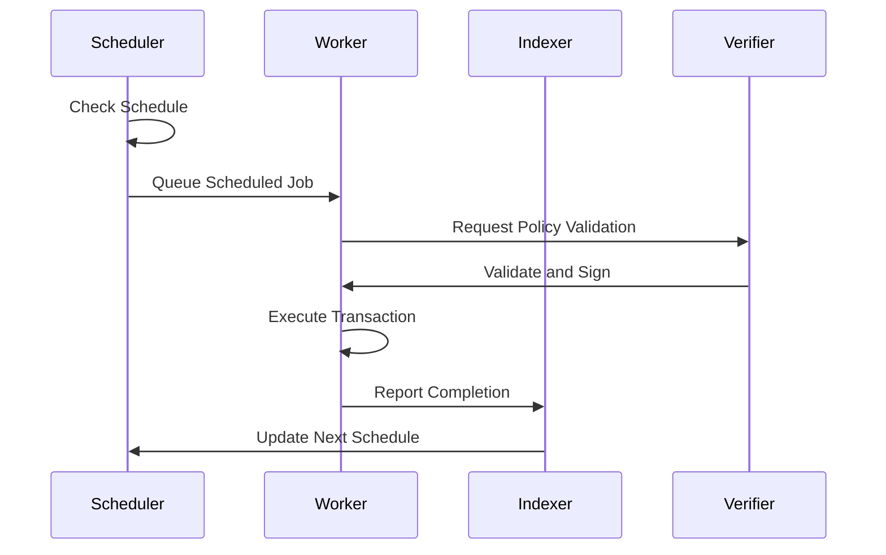

# App Services Architecture

## TL;DR

The Vultisig app ecosystem uses a distributed architecture with four core services: **HTTP Server** (API interface and app management), **Worker Service** (asynchronous transaction processing), **Scheduler Service** (time-based triggers and recurring operations), and **Transaction Indexer** (blockchain monitoring and event processing). These services communicate through Redis queues and interact with Vultisig's managed Verifier infrastructure for TSS-based transaction signing. To build your own app, implement the HTTP Server and transaction logic locally, import the Scheduler and TX Indexer from the verifier package, test against local Vultisig infrastructure, then submit an app configuration YAML for production deployment where only your custom services run while the [Verifier](https://github.com/vultisig/verifier) and [Fee App](https://github.com/vultisig/feeplugin) remain Vultisig-managed. Key packages include `github.com/vultisig/verifier/plugin`, `github.com/vultisig/recipes/engine`, `github.com/hibiken/asynq` for queuing, and blockchain-specific clients for EVM, Solana, and Bitcoin networks.

## Overview

The Vultisig app ecosystem is built on a distributed architecture with specialized services that handle different aspects of automated transaction processing. Each service has distinct responsibilities and communicates through well-defined interfaces to ensure security, scalability, and maintainability.

## Core Services Architecture



This is a diagram of the verifier's components, but in general all apps have the same structure

***
## Service Components

### 1. HTTP Server

The HTTP Server is the primary interface for external interactions and app management.

**Responsibilities:**
- Handle API requests from users and external systems
- Manage app installation and configuration
- Serve automation creation and management endpoints
- Provide real-time status and monitoring information
- Handle authentication and authorization

**Key API Endpoints:**
```go
// Plugin Management
pluginGroup.POST("/policy", s.CreatePluginPolicy)
pluginGroup.PUT("/policy", s.UpdatePluginPolicyById)
pluginGroup.DELETE("/policy/:policyId", s.DeletePluginPolicyById)
pluginGroup.GET("/recipe-specification", s.GetRecipeSpecification)

// Vault Operations
vaultGroup.POST("/reshare", s.ReshareVault)
vaultGroup.GET("/get/:pluginId/:publicKeyECDSA", s.GetVault)
vaultGroup.GET("/exist/:pluginId/:publicKeyECDSA", s.ExistVault)
vaultGroup.DELETE("/:pluginId/:publicKeyECDSA", s.DeleteVault)

// Transaction Management
vaultGroup.POST("/sign", s.SignMessages)
vaultGroup.GET("/sign/response/:taskId", s.GetKeysignResult)
```

**Technology Stack:**
- **Framework**: Echo (Go HTTP framework)
- **Authentication**: JWT tokens
- **Validation**: Custom middleware for request validation
- **Monitoring**: Built-in health check endpoints

**Configuration Example:**
```json
{
  "server": {
    "host": "0.0.0.0",
    "port": "8080",
    "read_timeout": "30s",
    "write_timeout": "30s"
  },
  "cors": {
    "allowed_origins": ["*"],
    "allowed_methods": ["GET", "POST", "PUT", "DELETE"],
    "allowed_headers": ["*"]
  }
}
```
***
### 2. Worker Service

The Worker Service handles asynchronous job processing and transaction execution.

**Responsibilities:**
- Process transaction signing requests
- Execute scheduled tasks and recurring operations
- Handle retry logic for failed operations
- Manage resource-intensive computations
- Coordinate with the Verifier for TSS operations

**Job Processing Pipeline:**
1. **Job Reception**: Receive jobs from Redis queue
2. **Validation**: Validate job parameters and automation compliance
3. **Transaction Construction**: Build blockchain transactions using Recipes
4. **Signing Request**: Request signature from Verifier
5. **Broadcasting**: Submit signed transactions to blockchain networks
6. **Result Handling**: Process results and update job status

**Key Features:**
- **Concurrency Control**: Configurable worker pools
- **Error Handling**: Automatic retry with exponential backoff
- **Resource Management**: Memory and CPU usage monitoring
- **Monitoring**: Job processing metrics and logging
***
### 3. Scheduler Service

The Scheduler Service manages time-based triggers and recurring operations.

**Responsibilities:**
- Queue periodic tasks (subscriptions, recurring payments)
- Manage execution timing and frequency
- Handle rate limiting and throttling
- Coordinate with business logic for trigger conditions
- Maintain scheduling state and persistence

**Scheduling Patterns:**
- **Fixed Intervals**: Execute every N seconds/minutes/hours
- **Cron-like Scheduling**: Complex time-based triggers
- **Event-driven**: Triggered by blockchain events or external conditions
- **Rate Limited**: Ensure compliance with automation rate limits

**Implementation:**
```go
type SchedulerConfig struct {
    MaxTxsPerWindow     int           `json:"max_txs_per_window"`
    RateLimitWindow     time.Duration `json:"rate_limit_window"`
    CheckInterval       time.Duration `json:"check_interval"`
    EnabledScheduleJobs []string      `json:"enabled_schedule_jobs"`
}
```

**Example Usage:**
```go
// Schedule a recurring payment
scheduler.ScheduleRecurring(ScheduleRequest{
    PolicyID:    "policy-123",
    Interval:    24 * time.Hour,
    StartTime:   time.Now().Add(time.Hour),
    JobType:     JobTypeScheduledPayment,
    Parameters:  paymentParams,
})
```
***
### 4. Transaction Indexer

The Transaction Indexer monitors blockchain networks and processes relevant events.

**Responsibilities:**
- Monitor blockchain networks for transaction confirmations
- Index app-related transactions and events
- Trigger post-transaction processing
- Maintain transaction history and state
- Provide blockchain data for business logic

**Supported Networks:**
- **EVM Chains**: Ethereum, Polygon, Arbitrum, Base, Optimism, Avalanche, BSC, Blast, Cronos, zkSync, Mantle, Sei (and other EVM chains as supported)
- **UTXO Chains**: Bitcoin, Litecoin, Dogecoin, Bitcoin Cash, Dash, Zcash
- **Solana**: Program logs and account changes
- **THORChain / MayaChain**: Cross-chain transaction tracking
- **Other**: XRP, Tron

**Event Processing:**
```go
type EventProcessor interface {
    ProcessBlock(ctx context.Context, blockHeight uint64) error
    ProcessTransaction(ctx context.Context, txHash string) error
    ProcessEvent(ctx context.Context, event BlockchainEvent) error
    GetLatestBlock(ctx context.Context) (uint64, error)
}
```

**Key Features:**
- **Real-time Monitoring**: WebSocket connections for live updates
- **Historical Indexing**: Backfill missed blocks during downtime
- **Multi-chain Support**: Unified interface across different blockchains
- **Reliable Processing**: Checkpoint-based progress tracking
***
## Service Interaction Patterns



## Building Your Own App Services

### Service Deployment Model

**For Development and Testing:**
- Developers can run local instances of all services including Verifier and Fee App
- Use provided Docker configurations for local development
- Test your app against local Vultisig infrastructure

**For Production Deployment:**
- Only your custom app services (HTTP Server, Worker, Scheduler, TX Indexer) are deployed
- Verifier and Fee App remain Vultisig-managed infrastructure
- Submit app configuration YAML for review and approval

### App Proposal Process

To deploy your app to production:

1. **Develop and Test Locally** using the full Vultisig stack
2. **Prepare App Configuration YAML** (see App Configuration section below)
3. **Submit App Proposal** to Vultisig for review
4. **Security Review** by Vultisig team
5. **Production Deployment** on approved infrastructure

### Required Components

To build a complete app, you need to implement these core components:

#### 1. HTTP Server for core functionality (reshare, automations, etc.)
For reference, you may use [app-recurring](https://github.com/vultisig/app-recurring)
#### 2. TX preparation and proposing logic
Do it in accordance with user's signed automations
#### 3. Scheduler and Tx indexer
You can import it from verifier package

### Essential Packages

#### Core Packages
```go
// Verifier integration
"github.com/vultisig/verifier/plugin"
"github.com/vultisig/verifier/plugin/server"
"github.com/vultisig/verifier/plugin/policy"
"github.com/vultisig/verifier/vault"

// Recipes for blockchain integration
"github.com/vultisig/recipes/engine"
"github.com/vultisig/recipes/types"
"github.com/vultisig/recipes/sdk/evm"

// Queue management
"github.com/hibiken/asynq"

// Database
"github.com/jackc/pgx/v5"
"github.com/jackc/pgx/v5/pgxpool"

// HTTP framework
"github.com/labstack/echo/v4"
```

#### Blockchain Clients
```go
// EVM chains
"github.com/ethereum/go-ethereum/ethclient"

// Solana
"github.com/gagliardetto/solana-go"
"github.com/gagliardetto/solana-go/rpc"

// Bitcoin
"github.com/btcsuite/btcd/rpcclient"
```