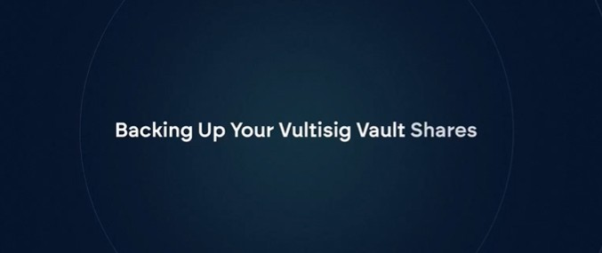

# Backup & Recovery


**This is the most important page in the documentation.**

Without proper backups, you WILL lose access to your funds if a device is lost, stolen, or damaged. Read this entire page before storing any significant value.


***

## How Vultisig Backups Work

Vultisig doesn't use seed phrases. Instead, each device in your vault has a unique **Vault Share** - a file that allows that device to participate in signing.

**Key concepts:**
- Each device has its **own unique** vault share
- Each device needs its **own backup**
- A single vault share alone cannot access your funds
- You need your signing threshold of shares to recover (e.g., 2 shares for a 2-of-3 vault)

***

## Video Overview

[](https://x.com/vultisig/status/1981438381184958698)

***

## How to Backup

### Step-by-Step

1. Open Vultisig app
2. Go to **Settings** → **Vault Settings**
3. Select **Backup**
4. (Optional) Set an encryption password for extra security
5. Save the `.vult` file to a secure location
6. **Repeat for every device** in your vault

### Video Guide

[](https://twitter.com/iceman00008/status/1824686908368412732/video/1)

***

## Understanding Vault Share Files

Vault shares use the `.vult` extension and are named:

```
vaultname-ID-share(t)of(n).vult
```

Example: `savings-ef8b-share1of2.vult`
- `savings` = vault name
- `ef8b` = vault ID
- `share1of2` = this is share 1 of a 2-share vault


**DKLS vaults** use "share" in the filename.
**GG20 vaults** use "part" in the filename.


***

## Where to Store Backups


**NEVER store multiple vault shares in the same location!**

If someone gains access to enough shares, they can reconstruct your vault and steal your funds.


### Recommended Storage Strategy

| Share | Storage Location |
|-------|------------------|
| Share 1 | Google Drive |
| Share 2 | iCloud |
| Share 3 | Dropbox |

### Good Practices

- Use different cloud providers for different shares
- Consider password managers (1Password, Bitwarden) for individual shares
- Use offline storage (USB drive, external hard drive) for maximum security
- Encrypt your backups with a strong password

### Bad Practices

- Storing all shares on one device
- Storing all shares in one cloud account
- Emailing shares to yourself (all in one inbox)
- Storing shares unencrypted on shared computers

***

## Estate Planning (Gold Standard)

For inheritance and emergency access:

1. **Share 1**: Keep in your personal secure storage
2. **Share 2**: Give to spouse or trusted family member
3. **Share 3**: Give to family lawyer or accountant


Ensure the people holding shares cannot easily collaborate without your knowledge.


***

## Recovering a Lost Device

If you lose a device, you have two options:

### Option 1: Import Backup

Import your backed-up vault share into a new device:
1. Install Vultisig on the new device
2. Open the `.vult` file (or import via app)
3. Enter the encryption password (if set)
4. Your vault is restored on the new device


Vault shares are cross-platform. An iOS backup can be imported on Android, Windows, etc.


### Option 2: Reshare (2-of-3+ vaults only)

If you have a 2-of-3 or larger vault:
1. Use your remaining devices to [reshare](../app-guide/vault-management/vault-reshare.md) the vault
2. This creates new shares including one for your new device
3. **Important**: Old backups become invalid after resharing

***

## Critical Warnings


**Backups are reshare-sensitive**

After using the [reshare feature](../app-guide/vault-management/vault-reshare.md), all old backups become invalid. You must create new backups after every reshare.



**Fast Vaults still need backups**

Even though Vultisig's server is a co-signer, you still need to backup your device's share. The server cannot recover your vault alone.



**Fast Vault Priority: Device Share First**

For Fast Vaults, the device backup is the most important. If you have your device share and remember the password you set during creation, you can always request the server share again via email. Prioritize securing your device share backup.


***

## Backup Checklist

Before storing significant funds, confirm:

- [ ] I have backed up **every device** in my vault
- [ ] Each backup is stored in a **different location**
- [ ] I understand that I need **[threshold] shares** to recover
- [ ] I have tested importing a backup on a spare device (optional but recommended)
- [ ] I have set encryption passwords on my backups (optional but recommended)

***

## Next Step

Once backed up, you're ready for your [First Transaction](first-transaction.md).
