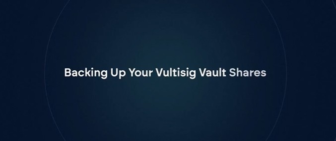

# Backup a Vultisig Vault


**Back up before you deposit.**

There is no seed phrase to write down. The backup is a file from each device. If a device is lost, stolen, or broken and you have no file, the funds are gone. Read this page before you put money in.


***

## How backups work

Think of each device as holding one key to the same safe. The backup is a copy of that device's key — a `.vult` file. You need enough of those copies to meet the vault's threshold.

* Each device has its own share, and its own backup
* One share alone cannot move funds
* Recovery needs the signing threshold (for example, 2 shares for a 2-of-3 vault)

***

## Video Overview

[](https://x.com/vultisig/status/1981438381184958698)

***

## How to Backup


Backups get created when creating a vault. But should be verified and can be exported again.


### Step-by-Step

1. Open the app
2. Go to **Settings** → **Vault Settings**
3. Tap **Backup**
4. Optionally set a password on the file — you will need it to restore
5. Save the `.vult` file somewhere you will still have if this device is gone
6. **Repeat on every other device** in the vault

### Video Guide

[](https://twitter.com/iceman00008/status/1824686908368412732/video/1)

***

## Understanding Vault Share Files

Vault shares use the `.vult` extension and are named:

```
vaultname-ID-share(t)of(n).vult
```

Example: `savings-ef8b-share1of2.vult`

* `savings` = vault name
* `ef8b` = last numbers of vault ID
* `share1of2` = this is share 1 of a 2-share vault


**DKLS vaults** use "share" in the filename. **GG20 vaults** use "part" in the filename.


***

## Where to Store Backups


**NEVER store multiple vault shares in the same location!**

If someone gains access to enough shares, they can reconstruct your vault and steal your funds.


### Recommended Storage Strategy

| Share   | Storage Location |
| ------- | ---------------- |
| Share 1 | Google Drive     |
| Share 2 | iCloud           |
| Share 3 | physical USB     |

### Good Practices

* Use different cloud providers for different shares
* Consider password managers (1Password, Bitwarden) for individual shares
* Use offline storage (USB drive, external hard drive)
* Encrypt your backups with a strong password

### Bad Practices

* Storing all shares on one device
* Storing all shares in one cloud account
* Emailing shares to yourself (all in one inbox)
* Storing shares unencrypted on shared computers

***

## Estate Planning (Gold Standard)

For inheritance and emergency access:

1. **Share 1**: Keep in your personal secure storage
2. **Share 2**: Give to spouse or trusted family member
3. **Share 3**: Give to family lawyer or accountant


Ensure the people holding shares cannot easily collaborate without your knowledge.


***

## Recovering a Lost Device

If you lose a device, you have two options:

### Option 1: Import Backup

Import your backed-up vault share into a new device:

1. Install Vultisig on the new device
2. Open the `.vult` file (or import via app)
3. Enter the encryption password (if set)
4. Your vault is restored on the new device


Vault shares are cross-platform. An iOS backup can be imported on Android, Windows, etc.


### Option 2: Reshare (2-of-3+ vaults only)

If you have a 2-of-3 or larger vault:

1. Use your remaining devices to [reshare](../app-guide/vault-management/vault-reshare.md) the vault
2. This creates new shares including one for your new device
3. **Important:** Export new backups immediately. After reshare, all shares change. Use the new backups for the new share set. The old share set can still sign with each other as a parallel set. Do not mix old and new backups.

***

## Critical Warnings


**Backups are reshare-sensitive**

After a [reshare](../app-guide/vault-management/vault-reshare.md), export backups of the **new** shares. Those are the backups for the vault you are using now. Old shares can still sign with each other as a parallel set. Do not mix the two sets. Discard old backups once you have verified the new ones.



**Fast Vaults still need backups**

Even though Vultisig's server is a co-signer, you still need to backup your device's share. The server cannot recover your vault alone.



**Fast Vault Priority: Device Share First**

For Fast Vaults, the device backup is the most important. If you have your device share and remember the password you set during creation, you can always request the server share again via email. Prioritize securing your device share backup.


***

## Backup Checklist

Before storing significant funds, confirm:

* [ ] I have backed up **every device** in my vault
* [ ] Each backup is stored in a **different location**
* [ ] I understand that I need **\[threshold] shares** to recover
* [ ] I have tested importing a backup on a spare device (optional but recommended)
* [ ] I have set encryption passwords on my backups (optional but recommended)

***

## Next Step

Once backed up, you're ready for your [First Transaction](first-transaction.md).
