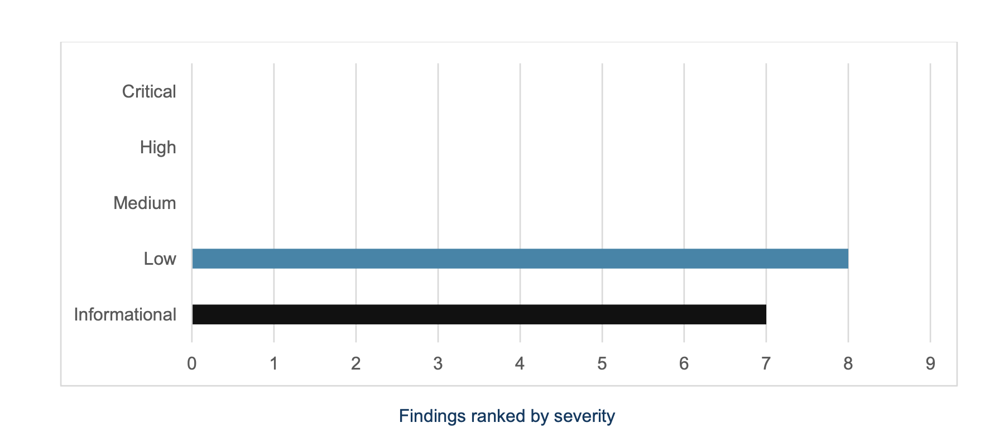

# Security

## Audits

Kudelski Audit of `mobile-tss-lib`

<figure><figcaption></figcaption></figure>



> 1.5 Follow-up
>
> After the draft report (v1.0) was delivered, the Client addressed all findings in the following
>
> PRs:
>
> • Audit 1 #17 (commit 06fc76f4d6d34f21fa5d1cafd1eb594d8ac4fdd7)
>
> • Audit 2 #18 (commit 2577eb3b00d4d58a7318fa0ada726ba7965579ab)

## TSS-Security

TSS (GG20), whilst a relatively new cryptographically protocol, has been tested in the wild extensively by THORChain (thorchain.org) in an open-source and adversarial environment. The fact that it works today with a non-zero amount of funds in vaults is testament to the robustness of the protocol.

Vultisig also implements GG20; but in a non-adverserial environment. Your trusted devices only connect to each other in deliberate sessions after being unlocked by you or your device owner. Thus they cannot be attacked whilst you sleep with your devices locked/asleep as well.

