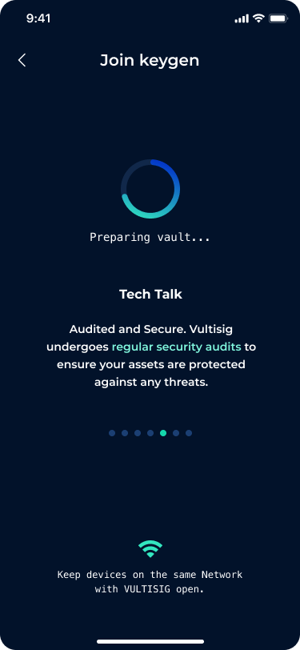

# Creating a Vault

## Overview

There are different types of vaults that can be created in the Vultisig App, designed to meet all users' needs and configuration preferences. From a 'hot wallet' option to a 'cold wallet' option, users have full flexibility in creation and modification afterward.

Creating a Vault is also called a Key Generation (KeyGen) event, see more information [here](../threshold-signature-scheme/tss-actions.md#key-generation).

## Setup - Vault Types


iOS, MacOs, Android, Windows and eventually Linux are intended to be supported. Check the [website](https://www.vultisig.com) for the latest update on distribution.


There are three general setup types to choose from:

* Fast Vaults&#x20;
* Active Vaults&#x20;
* Secure Vaults

### Fast Vaults

This setup is the 'hot wallet' equivalent in Vultisig, enabling vaults to be created on the go without the need for multiple devices from the user.

<figure><figcaption>
Fast Vaults in app
</figcaption></figure>

Fast Vaults are configured as a two-factor vault, where one device is held by the user and the other part is the Vultiserver, which automatically co-signs the user's requests (learn more about what a Vultisigner is [here](broken-reference)), making it a single signature experience.\
In the future, [transaction policies](../vultisigner/what-can-be-configured.md) will allow users to specify parameters for co-signing. &#x20;

It is recommended not to store large amounts in these vaults and to use them as a daily wallet or 'hot wallet.'

### Active Vaults

This setup offers increased security compared to Fast Vaults and is therefore considered the "normal wallet" in Vultisig.&#x20;

Active Vaults consist of two user devices and the [Vultisigner](broken-reference). This configuration allows users to sign transactions with just one device while on the go, with the set [transaction policies](../vultisigner/what-can-be-configured.md) applied. \
These policies can be configured to be very strict. \
However, signing transactions with only the user's devices can bypass these policies, allowing for user-authorized unrestricted transactions.

<figure><figcaption>
Active Vault in app
</figcaption></figure>

This setup provides the flexibility of a single-signature wallet with much higher security, while also applying multi-factor authentication for high-value transactions

### Secure Vault

This setup offers the highest level of security and is considered the 'cold wallet' equivalent in the Vultisig App.&#x20;

<figure><figcaption>
Secure Vault in app
</figcaption></figure>

Secure Vaults consist solely of user devices. \
Users needs at least three devices and can add more to their vaults, increasing the signing threshold and enhancing security with each additional device. \
This option is also ideal for shared wallets among multiple users and DAOs.

The vaults will be a `m`-of-`n` Threshold,  where m is at least 2/3rds of `n`, and no maximum number of `n` devices. The more devices you use, the longer it will take to process any transactions.

The following are the most common vaults:

1. **2-of-3 vault** - three devices to create a vault and two to sign a transaction. This is automatically backed up (one device is the backup) so you don't need to export vault shares. But you should do this anyway. **This vault type is recommended as a secure vault setup.**
2. **3-of-4 vault** - four devices to create a vault and three to sign a transaction. This is automatically backed up (one device is the backup) so you don't need to export vault shares. But you should do this anyway.


What is the most redundant vault that allows you maximum flexibility?

Try this:\
1\) Use 3 different builds (Mac, iOS, Android) on 3 different devices.

2\) Export vaults shares with 3 different passwords to encrypt.

3\) Save vault shares in 3 different Cloud Storage options (Google, iCloud, Proton, Dropbox etc), each with a unique email address per Cloud Storage.\
4\) Ensure each email has 2FA.\
\
To compromise this vault, an attacker would need to\
1\) Break into 2 different emails, intercept your 2FA, AND crack 2 different passwords, or\
2\) Compromise 2 different devices (get past passcodes and biometrics).

If you practice good security, the likelihood of this is significantly low, almost zero. (How many times has someone broken into 1 of your devices/email/storage accounts, let alone 2).

The advantage of this setup is you can re-spawn anywhere in the world with just your email accounts and passwords, without carrying around hardware wallets and seed-phrases.


## Generating A Vault

<figure><figcaption>
Keygen Flowchart
</figcaption></figure>

_Click on the above image to watch an explanation video on Twitter_

### How to generate a Vault


Remember - all your devices must have the Vultisig open and must be connected to the same Wi-Fi network or Internet, using the Vultisig Relay Server.\
**The keygen will fail if the connection is not stable.**


Get your devices ready and create a vault.

<figure><figcaption>
Create Vault
</figcaption></figure>

Select the Vault setup of preference:

* Fast Vault
* Active Vault
* Secure Vault

<figure><figcaption></figcaption></figure>

After selecting your preferred setup, follow the steps for the following Setups\*\*:\*\*

#### Fast Vault

1. Name your Vault: Put in a preferred Vault Name
2. Put in email: The Vault Share will be sent to this address as a backup
3. Password: This encrypts the Vault Share received via email
4. Passcode: To quick access the server and change transaction policies (still to be implemented)
5. Wait until Vault is Created
6. Done!

#### Active Vault

1. Name your Vault: Put in a preferred Vault Name
2. Put in email: The Vault Share will be sent to this address as a backup
3. Password: This encrypts the Vault Share received via email
4. Passcode: To quick access the server and change transaction policies (still to be implemented)
5. Scan QR Code with second device and wait until Server is present
6. Start Vault creation and wait until it finished
7. Done!

#### Secure Vault

Start Vault creation with main device and join with all pairing devices.

**Main Device:** START -> will show a QR Code to scan with your pairing device(s)

<figure><figcaption></figcaption></figure>

**Pairing Devices:** PAIR -> will start the camera to scan the QR code or a shared QR code can be imported.

<figure><figcaption></figcaption></figure>

When all wanted pairing devices are present, create the vault with the `Continue` button.

### Network Type

You can choose Internet or WiFI.

1. **Internet:** Using the Vultisig relay server. Encrypted packages are routed through the Vultisig relay server.
2. **Wi-Fi**: Using local Network, however may not work on some Wi-Fi networks (since they may block mDNS packets)

<figure><figcaption></figcaption></figure>

### Keygen

Once you click CONTINUE, the keygen process will begin. First it will create the pre-parameters (your vault shares and some other aspects, about 10 seconds), then it will create the ECDSA and EdDSA keys (another 10 seconds).\
Finally, it is done! Make sure that all devices show the done screen.

<figure><figcaption></figcaption></figure>

### Troubleshooting

If a Keygen fails, it may be because you have an unreliable network and the devices dropped connections.

1. Quit the apps.
2. Change networks.
3. Start again.

Another reason are low spec android devices. \
Please ensure that your device has at **least 4 GB RAM**
