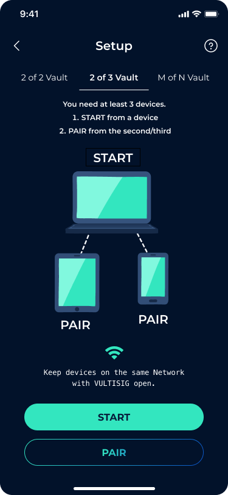

# Creating a Vault

Creating a Vault is also called a Key Generation event, see [here](../threshold-signature-scheme/tss-actions.md#key-generation)

## Setup

You first need to download the Vultisig App to two or more devices.


iOS, MacOs, Android, Windows and eventually Linux are intended to be supported. Check the website for the latest update on distribution.&#x20;


## Vault Types

The vaults will be `m`-of-`n`, where m is at least 2/3rds of `n`, and no maximum number of `n` devices. The more devices you use, the longer it will take to process any transactions.

The following are the most common vaults:

1. **2-of-2 vault** - only need two to create a vault and two to sign a transaction. Note, it is not automatically "redundant" so you absolutely should export the vault shares and store them separately and securely. This will be the most popular vault type as this is the most convenient. **For its convenience, this is also the least secured vault type.**
2. **2-of-3 vault** - three devices to create a vault and two to sign a transaction. This is automatically backed up (one device is the backup) so you don't need to export vault shares. But you should do this anyway. **This vault type is recommended, as it is more secured than 2-of-2 vault.**
3. **3-of-4 vault** - four devices to create a vault and three to sign a transaction. This is automatically backed up (one device is the backup) so you don't need to export vault shares. But you should do this anyway.


What is the most redundant vault that allows you maximum flexibility?&#x20;

Try this:\
1\) Use 3 different builds (Mac, iOS, Android) on 3 different devices.&#x20;

2\) Export vaults shares with 3 different passwords to encrypt.&#x20;

3\) Save vault shares in 3 different Cloud Storage options (Google, iCloud, Proton, Dropbox etc), each with a unique email address per Cloud Storage. \
4\) Ensure each email has 2FA. \
\
To compromise this vault, an attacker would need to\
1\) Break into 2 different emails, intercept your 2FA, AND crack 2 different passwords, or\
2\) Compromise 2 different devices (get past passcodes and biometrics).

If you practice good security, the likelihood of this is significantly low, almost zero. (How many times has someone broken into 1 of your devices/email/storage accounts, let alone 2).&#x20;

The advantage of this setup is you can re-spawn anywhere in the world with just your email accounts and passwords, without carrying around hardware wallets and seed-phrases.&#x20;


## Generating A Vault

<figure><figcaption>
Keygen Flowchart
</figcaption></figure>

### How to generate a Vault


Remember - all your devices must have the Vultisig open and must be connected to the same Wi-Fi network or Internet, using the Vultisig Relay Server. \
**The keygen will fail if the connection is not stable.**


Get your devices ready and create a vault.

<figure><figcaption></figcaption></figure>

Select the Vault setup of preference:&#x20;

* 2-of-2
* 2-of-3
* &#x20;`m`-of-`n`

<figure><figcaption></figcaption></figure>

After selecting your preferred setup, follow these steps for the following devices**:**

**Main Device:** START -> will show a QR Code to scan with your pairing device(s)

<figure><figcaption></figcaption></figure>

**Pair Device:** PAIR -> will start the camera to scan the QR code or a shared QR code can be imported.

<figure><figcaption></figcaption></figure>

### Network Type

You can choose Internet or WiFI.

1. **Internet:** Using the Vultisig relay server. Encrypted packages are routed through the Vultisig relay server.
2. **Wi-Fi**: Using local Network, however may not work on some Wi-Fi networks (since they may block mDNS packets)

<figure><figcaption></figcaption></figure>

### Keygen

Once you click CONTINUE, the keygen process will begin. First it will create the pre-parameters (your vault shares and some other aspects, about 10 seconds), then it will create the ECDSA and EdDSA keys (another 10 seconds). \
Finally, it is done! Make sure that all devices show the done screen.

<figure><figcaption></figcaption></figure>

### Troubleshooting

If a Keygen fails, it may be because you have an unreliable network and the devices dropped connections.

1. Quit the apps.
2. Change networks.
3. Start again.
