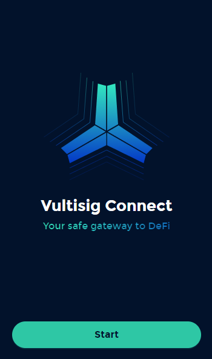

# Vault Backups

## What is a Backup in Vultisig

Vultisig implements a novel backup and recovery mechanism that differs from traditional seed phrase-based approaches.\
This mechanism also utilizes the Threshold Signature Scheme (TSS) technology to generate so called          "[**Vault Shares**](vault-backup.md#what-are-vault-shares)", that enable more secure and reliable wallet recovery without seed phrases.\
These shares store all the data necessary to participate in Keygen/Keysign sessions and restore the Vault upon import.\
They never store any secret key or seed phrase.


The parameters stored in Vault Shares are non-sensitive data and are unique to the device on which they are created, making Vault Shares unique and not interchangeable with eachother.


<figure><figcaption>
Backup in Settings
</figcaption></figure>


**Vault shares should always be backed up.**


***

## What are Vault Shares?

* Vault shares are the backups to recover Vaults in Vultisig.
* <mark style="color:red;">Each device in the vault has its</mark> <mark style="color:red;"></mark><mark style="color:red;">**own unique**</mark> <mark style="color:red;"></mark><mark style="color:red;">vault share. So each device needs its</mark> <mark style="color:red;"></mark><mark style="color:red;">**own backup**</mark>.
* Each vault share by itself does not have access to any assets, so it is safe to export and store them digitally.
* They use the **.vult** extension standard for easy identification
* Due to the .vult extensions shares can be directly imported when opened.
* To easily identify which Vault Share is backed up and which is missing, they are labeled as follows:

$$
vaultname-ID-part(t)of(n).vult
$$

vaultname: Set name of the vault\
ID: ID of the vault\
t: share of the vault\
n: total shares&#x20;

Example: You have a share called `savings-ef8b-part1of2.vult` backed up and `savings-ef8b-part2of2.vult` backed up. So you know the Vault is fully backed up. Secure.\
If you can't find one of the two (or respectively more parts) you know which device you need to back up


**Never** store different vault shares of the same vault in the same location, as this could potentially lead to loss of funds.\
This can happen if a malicious party gains access to that location and is able to reconstruct the vault.


### Digital Storage Suggestions

* [x] Storing vault-shares on different cloud drives/locations
* [x] Having independent cloud drives or password manager for each Vault share.
* [x] Ensuring that a device does not have access to multiple cloud drives or password managers that store Vault shares.
* [x] Use offline devices to store vault shares

Secure Example:&#x20;

* Store all Part 1 Shares on your Google Drive
* Store all Part 2 Shares on your iCould
* Store all Part 3 Shares on your Dropbox

### Estate planning (The gold standard for backing up Vaults)

To ensure access to your assets in the event of adverse circumstances or for inheritance purposes, we propose a solution that works really well but can be adapted to everyone's needs:

1. Zip all Part 1 shares
2. Store in your reach
3. Zip all Part 2 shares
4. Send to partner/trusted family member
5. Zip all Part 3 shares
6. Send to family laywer/accountant

This can be expanded to larger vaults if needed, but ensures that you are properly backed up.


You need to make sure that the counterparts receiving the parts cannot easily collaborate.


***

## How to Backup Vault shares?

_Click on the above image to watch an explanation video on Twitter_

In the app, navigate to `Settings` and proceed to `Vault Settings`.\
Select `Backup`, enter an optional backup encryption password and proceed with `Save`.\
If not needed, save the vault share by pressing `Skip` directly.

***

## Backup Encryption

It is possible to encrypt the Vault share with an optional password, adding an extra layer of security to the shares.

The Password option can either activated with putting in a strong password and **saving** it or can be **skipped**.

<figure><figcaption></figcaption></figure>

***

## **Recovering a lost device**

If a device is lost, there are two ways to recover the device:

* **Option 1:** Import the original backed-up vault share into a new device. Vault shares can be imported into any device that support Vultisig. E.g. a vault share created from an iOS device, can be imported into iOS, MacOS, Android, etc.
* **Option 2:** Reshare the vault using the two other devices to include a new device. This is only possible on a 2-of-3 setup.


**Backups are reshare sensitive**.\
This means that backups are incompatible with each other after using the reshare feature, see [here](vault-reshare.md#important-note-for-reshare) for more information.

