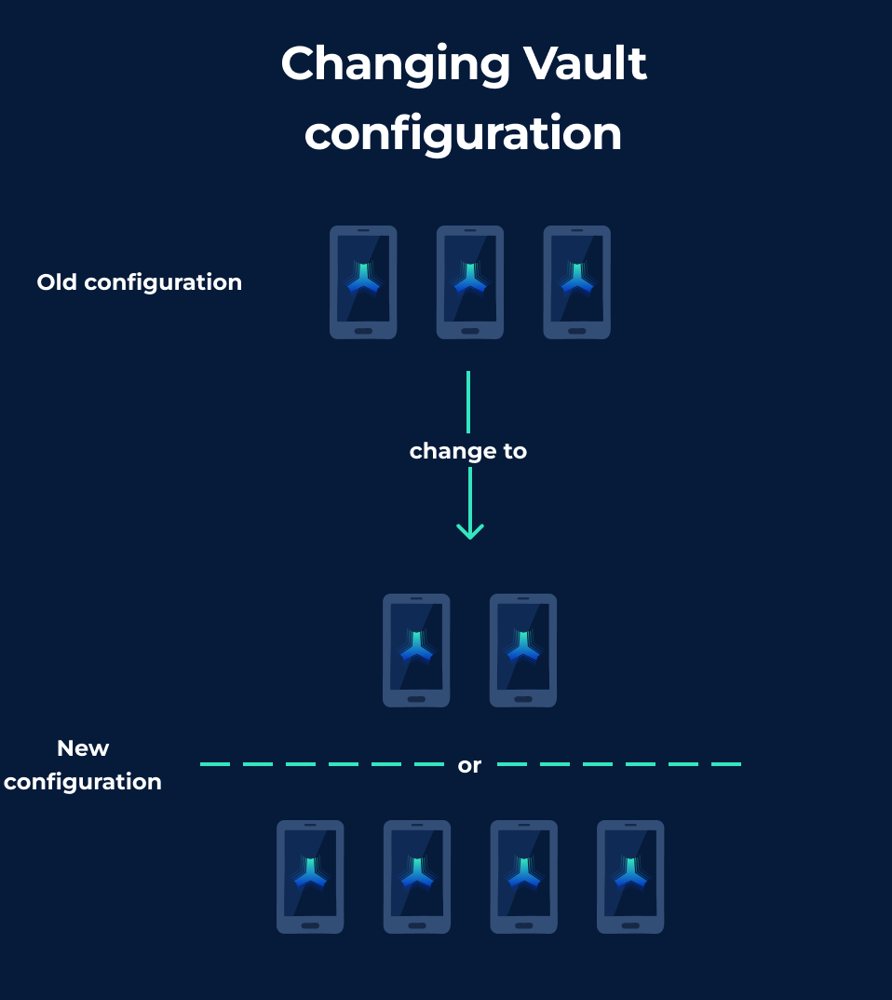

# Vault Reshare

<figure><figcaption>
Feature in settings
</figcaption></figure>

## What is the Reshare feature

Resharing is a feature that can be used to increase or decrease the number of participating devices in a Vault setup. In this setup also a Vultisigner can be included in the Vault setup without moving funds.

<figure><figcaption></figcaption></figure>

## How to use the Feature


A threshold majority is **always** required to use this feature.\
For example, for a 2-of-2 vault, both devices must be present.


Do this if a device has been lost in a secure setup and you need to add a new, unique device or update the current shares.\
_If a device of a 2-of-2 setup is lost please use the_ [_backup feature_](vault-backup.md)_._

_Click on the above image to watch an explanation video on Twitter_

After clicking "Reshare" in the Vultisig Vault menu, the next steps are very similar to creating a Vault, as the reshare feature is just another keygen ceremony.&#x20;

Start the Reshare with or without the Vultisigner present.

<figure><figcaption></figcaption></figure>

You can increase a vault setup by simply adding a new device, or decrease a vault setup by excluding (not joining with) a device from the keygen ceremony.


You always need the threshold of the current vault setup to change the configuration. Similar to when signing a transaction.


When resharing with Vultisigner, the steps are similar, but with the inclusion of the Vultisigner.\
The server checks if a Vault Share is currently present and requests the password. \
If a Vault Share is not present, a new share will be created on the server.

## When to use the Reshare feature

Like described in the section about [what the feature is](vault-reshare.md#what-is-the-reshare-feature), it can be used for the following:&#x20;

### Changing the Number of Parties

Changing the number of parties is as simple as joining another keygen session.\
This gives the ability to change the number of devices participating in a setup.\
New unique devices can be added or old devices can be excluded.

## **IMPORTANT NOTE FOR RESHARE**

After resharing a vault, the vault shares of each device may also change.


**Be sure to ALWAYS back up your Vault shares after using the reshare feature!**


Resharing invalidates the old backups of the shares in Vultisig and increases the risk that mixed backups will be imported and restored.\
**This can result in inaccessible vaults.**\
_If that happened the_ [_emergency recovery_](../../threshold-signature-scheme/emergency-recovery.md) _can be used as last resort._


Any device that was not present in a reshare will have a different vault share to the rest of the vault, making it impossible to join the keygen or keysign after the reshare.\
This is intentional, as vault shares can be disabled in Vultisig if a share is suspected of being compromised.

