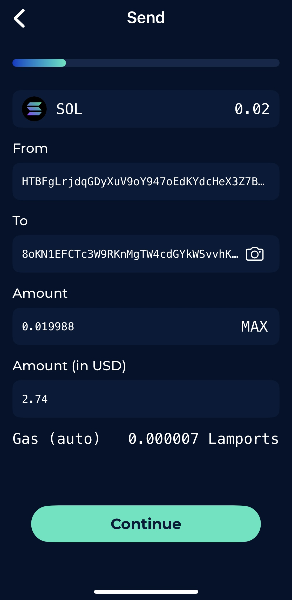
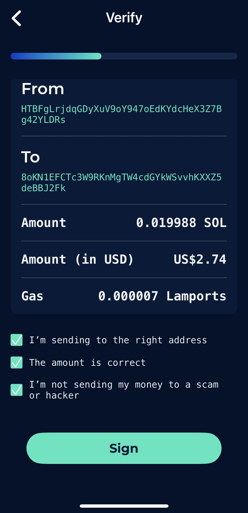
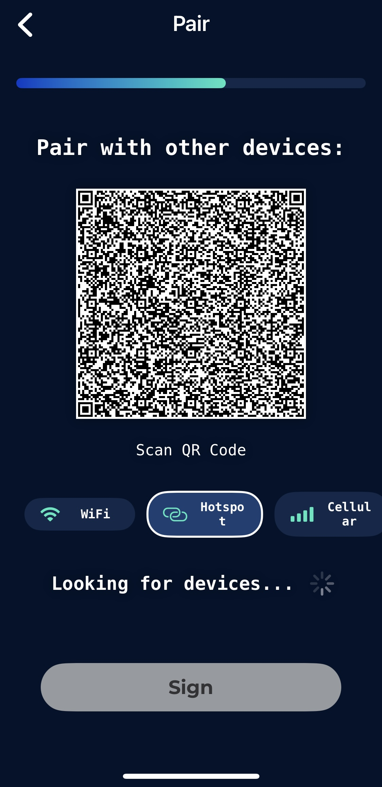
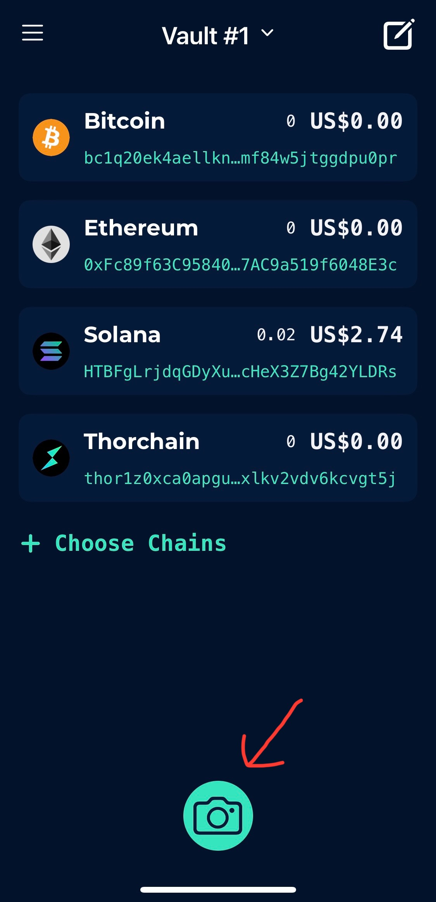
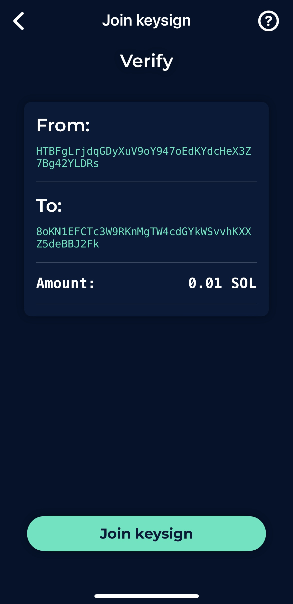
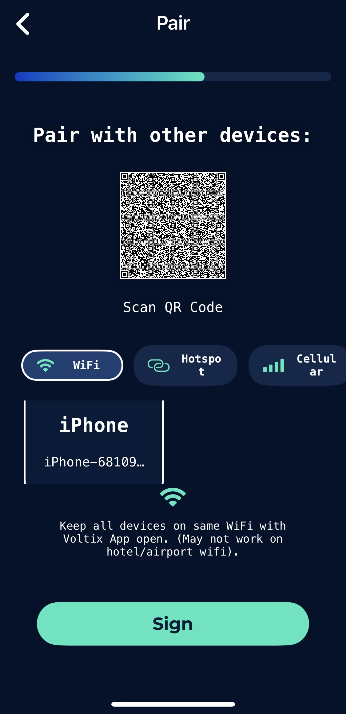

# Signing a Transaction

## Get your device's ready

Depending on your Vault type (2-of-2, 2-of-3, 3-of-4, or m-of-n), you need to have the threshold number of devices ready for the signing process.


Remember: One device is creating the transaction, and the other device is your "verification" device. You need to "pair" the devices to each other to exchange the transaction information.

Make sure you confirm the transaction on your pair device.

Both devices will co-sign and send the final transaction. Only one transaction will be sent (you won't have duplicate transactions).


## Main Device

On your Main Device, prepare the transaction (e.g. Send or Swap). When ready, click on **Continue**.

<figure><figcaption></figcaption></figure>

Confirm all the details on the Verify screen, check all boxes for the reminder messages, and click **Sign**.

<figure><figcaption></figcaption></figure>

On the Pair screen, a QR code will be generated. Choose the correct option: whether your other devices are in the same **Wi-Fi** or **Hotspot** network, or using **Cellular** connection.

<figure><figcaption></figcaption></figure>

## Pair Device

On your other device, after selecting the same Vault, click the **Camera** icon and scan the QR code shown on the first device.

<figure><figcaption></figcaption></figure>

The transaction details will load, so then check and click **Join key sign** to proceed.

<figure><figcaption></figcaption></figure>

## Main Device

On the Main Device, the other device's information will appear once synced. Select the other devices, and finally, click **Sign** to complete the transaction.

<figure><figcaption></figcaption></figure>

That's it! The transaction should sign and be sent by one of the devices.
