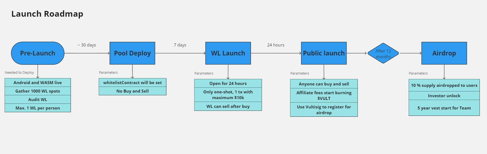

# Launch

## Token Allocation

| Allocation            | Amount     | Description                                               |
| --------------------- | ---------- | --------------------------------------------------------- |
| Launch Liquidity      | 80,000,000 | 80% is available at launch                                |
| 12 Month Airdrop      | 10,000,000 | 10% is distributed as an airdrop to users after 12 months |
| 5 year Annual Airdrop | 10,000,000 | 2% a year for 5 years                                     |

<figure><figcaption>
Token Allocation
</figcaption></figure>

## Launch Liquidity

All of the initial raise of capital from external investors (tentatively USD $2.4m) will be placed in a liquidity pool for launch, together with 80m $VULT (80% of total supply). Thus, FDV begins at $3m.

A 24hour whitelisted (WL) trade-only period will be the next phase (first come, first served among the WL addresses). Each WL address can execute only one single buy transaction, with a maximum of $10k. Sell transactions are also allowed during this period (but only whitelisted addresses who first bought, will have any $VULT to sell).

After 24 hours, the pool will be opened for unlimited buys/sells.

<figure><figcaption>
Launch Roadmap
</figcaption></figure>

The following is an indication of how the launch could go, and the subsequent 12 months.

<figure><figcaption></figcaption></figure>


These are fictional numbers


## LP Ownership

Instead of the direct token ownership, the Launch Liquidity is split between:

* Treasury
* Investors (12mo cliff)
* Team/Dev (12mo cliff, 5 year vest)
* Liquidity (12mo cliff, 5 year lock)

This guarantees:

1. Maximum liquidity for the asset
2. Minimum FDV for the launch
3. No non-circulating tokens with the exception of Airdrop Allocation

Tokens are auto-sold through the pool on behalf of LP Owners as the market interacts.

<figure><figcaption></figcaption></figure>

## Further Information

* The parties with 12mo cliff (Team/Dev, Investors & Liquidity) will not be able to withdraw from the LP during the vesting period. However, $VULT can still be freely bought/sold through the LP.
* Investors have claim to 30% of the launch liquidity, thus they are buying at $10m FDV.
* The first buy during the WL launch will be at $3m FDV.
