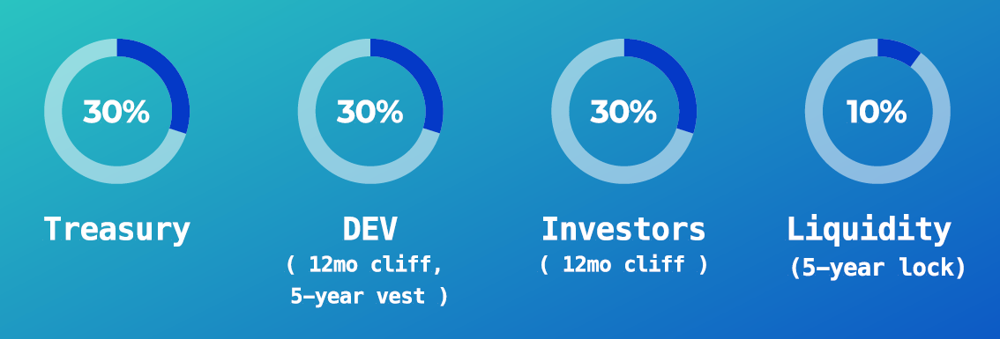

# Launch

## TLDR/FAQ

* Launch will be on Ethereum mainnet
* WhiteListed (WL) sell on 15-Aug-2024, 1pm UTC
* Max WL buy is 4 ETH or WETH (either ETH or WETH can be used)

## Token Allocation

| Allocation            | Amount     | Description                                                                          |
| --------------------- | ---------- | ------------------------------------------------------------------------------------ |
| Launch Liquidity      | 70,000,000 | 70% is available at launch                                                           |
| VULT-WEWE Merge       | 10,000,000 | 10% of the tokens used in the VULT-WEWE merge contract to facilitate the conversion. |
| 12 Month Airdrop      | 10,000,000 | 10% is distributed as an airdrop to users after 12 months                            |
| 5 year Annual Airdrop | 10,000,000 | 2% a year for 5 years                                                                |

<figure><figcaption>
Token Allocation
</figcaption></figure>

## Launch Liquidity

#### **Initial Funding**

Vultisig has raised $2.4 million from outside investors. A portion of this capital will be used to pair the 70 million $VULT tokens (which is 70% of the total supply) in a UNI V3 liquidity pool. By using the concentrated liquidity and range setting of UNI V3, the capital will be deployed in a range of $2.5 million to $10 billion FDV.\
This gives the opportunity to use the capital efficiently and deploy it in the required ranges to efficiently deploy the token on launch day.

**Initial Valuation**

This setup gives us the possibility to launch at a **fully diluted valuation (FDV) of $3 million**.

#### **Whitelisted Trade-Only Period**

The next phase is a 24-hour trade-only period for whitelisted (WL) addresses. Here are the key points:

* The trade-only period operates on a first-come, first-served basis among WL addresses.
* Each WL address can make multiple purchases, but the total cannot exceed 3 ETH.
* Sell transactions are allowed, but only whitelisted addresses that have already bought $VULT tokens will have any to sell.

#### **Open Trading**

After the 24-hour whitelisted period, the pool will be open for unlimited buy and sell transactions.

<figure><figcaption>
Launch Roadmap
</figcaption></figure>

#### **Launch Possibilities**

The following is an indication of how the launch could go based on the initial test run of the contract deployed as the [$WEWE](https://www.weweswap.com/) token but is not a guarantee.

<figure><figcaption>
WEWE price in the Whitelist phase
</figcaption></figure>

Any further price predictions can be taken from the $WEWE chart after the WL phase ended, but will not reflect exactly the actual $VULT launch.

## LP Ownership

Instead of the direct token ownership, the Launch Liquidity is split between:

* Treasury
* Investors (12-month cliff)
* Team/Dev (12-month cliff, 5-year vest)
* Liquidity (12-month cliff, 5-year lock)

This guarantees:

1. Maximum liquidity for the asset
2. Minimum Fully Diluted Valuation (FDV) for the launch
3. No non-circulating tokens with the exception of Airdrop Allocation

Tokens are auto-sold through the pool on behalf of LP Owners as the market interacts.

<figure><figcaption></figcaption></figure>

## Further Information

* The parties with 12-month cliff (Team/Dev, Investors & Liquidity) will not be able to withdraw from the Liquidity Pool during the vesting period. However, $VULT can still be freely bought/sold through the Liquidity Pool.
* Investors have claim to 30% of the launch liquidity, thus they are buying at $10m FDV.
* The first buy during the WL launch will be at $3m Fully Diluted Valuation (FDV).
* The launch pool will be on Uniswap V3, with a 1% swap fee setting.
