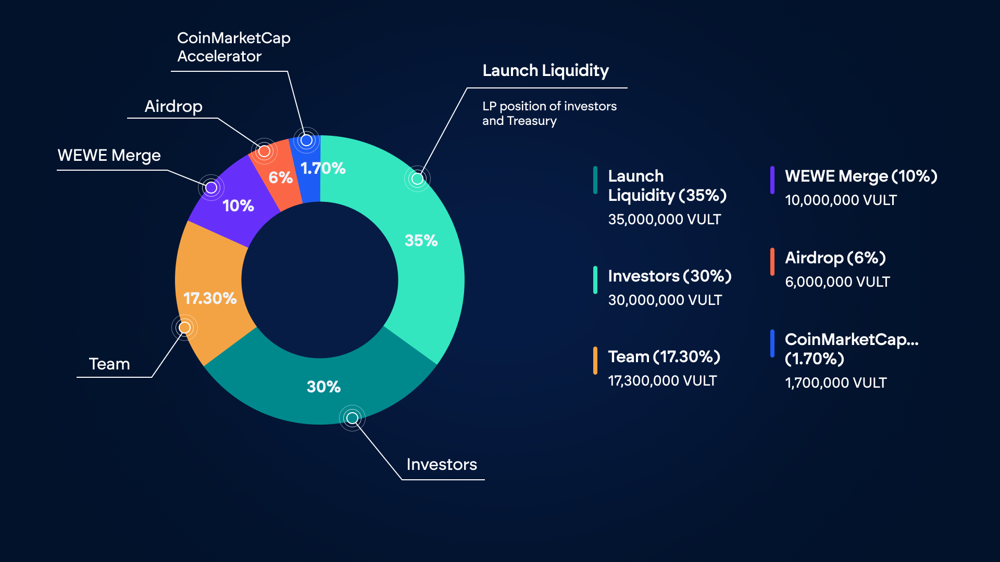

# The $VULT token

## Utility of $VULT token

The primary benefit comes through the staking mechanism, where $VULT holders will be able stake their tokens to earn direct $USDC cashback rewards generated from ecosystem activity.

Beyond passive income opportunities, $VULT unlocks preferential pricing and exclusive access to premium features across the Vultisig marketplace. As our ecosystem grows, so too will the utility and value proposition of holding VULT tokens.

Furthermore, the Vultisig token $VULT serves four important purposes:

1. To raise capital to accelerate the product during its bootstrap phase
2. To buy users and AUM as quickly as possible using an Airdrop
3. To provide incentives to contributors to build the product
4. To allow anyone to support the adoption trajectory of the product

## The $VULT Tokenomics

* 100,000,000 maximum supply
* ERC20 with ERC777 extensions: `approveAndCall()` and `_beforeTransferHook()`
* Ownable, but not mintable (to set launch params)
* Burnable

### Allocations

<figure><figcaption>
Allocations
</figcaption></figure>

## Vesting

Following vestings apply to above mentioned parties:

<figure><figcaption></figcaption></figure>

### **Launch Liquidity Allocation:**

* 24% of $VULT tokens are allocated to initial investors as an LP position, with a 1-year cliff to provide sufficient initial liquidity
* 11% of $VULT tokens come from the project Treasury and will be carefully managed for specific growth initiatives but intended to stay in the LP.


The Treasury allocation remains partially unlocked to fund exceptional opportunities that drive Vultisig adoption, including strategic partnerships, community giveaways, and hackathons. \
All Treasury token usage will be strictly limited to initiatives that directly increase Vultisig ecosystem value.


### **Token Allocation**

#### **Community and Strategic Allocations:**

* 6% of VULT reserved for community airdrop, rewarding early supporters. Unlocking with ending seasons and ditributed to airdrop participants
* 10% of $VULT dedicated to the $WEWE → $VULT merger, unlocked shortly after launch.&#x20;
* 1.7% of $VULT allocated to a strategic partnership with CoinMarketCap to significantly expand Vultisig’s reach and adoption. Locked with a 1-year cliff

#### **Team Commitment:**

* 17.3% of VULT allocated to the team with a 4-year linear vesting schedule, ensuring long-term alignment with project success

#### **Early Investor Structure:**

* 30% of $VULT distributed to early investors who fulfilled all their obligations by providing crucial funding that enables 3+ years of development runway and will be unlocked on launch.
* These investors initially bought in at a $70M fully diluted valuation (FDV), while the public launch begins at just $3M FDV, creating strong incentive alignment with the community
* Many investors have committed to providing additional liquidity at launch, helping stabilize price action and deepen the trading pool

## Value Accrual

The Vultisig $VULT token will accrue direct USDC revenue to the user when staked, coming from the fees generated by Vultisig.\
The more swaps and bridging that happen in Vultisig, the higher the real yield will be.


This feature is yet to be implemented and the exact parameters are still under evaluation.


<table><thead><tr><th width="373">Fee</th><th>Amount</th></tr></thead><tbody><tr><td>Swap Fees (Cross-chain and Token swaps)</td><td>50 basis points</td></tr><tr><td>Bridge Fees (Between EVMs and IBC)</td><td>10 basis points</td></tr><tr><td>Marketplace Fees (Plugins and Ai Agents)</td><td>30% of generated revenue</td></tr></tbody></table>
