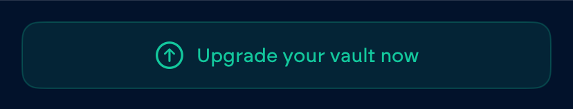

# Vault Upgrade


Upgrades are only available for vaults of the GG20 type.


## What is Upgrading?

Upgrading your Vault changes the underlying TSS protocol. This unlocks faster signing speeds and enables compatibility with the [Vultisig Extension](../../vultisig-ecosystem/vulticonnect/). More specific technical details are highlighted in the [TSS section](../../threshold-signature-scheme/threshold-signature-schemes-used-by-vultisig/) of the documentation.

***

## How to Upgrade?

Upgrading your Vault is simple. The application will guide you through the process.

You can initiate the upgrade by using the banner on the home screen or by selecting the option in the Vault settings.

<figure><figcaption>
Settings
</figcaption></figure> <figure><figcaption>
Home View
</figcaption></figure>

Upgrading your Vault is a new[ keygen](../creating-a-vault/#generating-a-vault) process that requires all initial devices (at first vault creation) to be present in order to complete it successfully.&#x20;

New [Vault shares ](vault-backup.md)are created. They need to be stored with the same precautions as the old shares.


Proper storage of the new backups is essential in order to prevent the risk of losing access to funds.


### How to distinguish between new and old backups?

To differentiate between the [GG20](../../threshold-signature-scheme/threshold-signature-schemes-used-by-vultisig/how-it-works.md) and [DKLS23](../../threshold-signature-scheme/threshold-signature-schemes-used-by-vultisig/how-dkls23-works.md) backups more easily, they have different names in their backup files.

| Type   | Name   |
| ------ | ------ |
| GG20   | parts  |
| DKLS23 | shares |

***

### How to upgrade Active Vaults?


Active Vaults are a discontinued feature, so they have a slightly different upgrade procedure.


To upgrade an Active Vault, the Server Share must be on a third device because Vultisig does not support upgrading Active Vaults. Therefore, the Active Vault must be transformed into a [Secure Vault](../creating-a-vault/#secure-vault).

To do this:

1. Import the Server share into a third device
2. Initiate the upgrade on the other devices.
3. Follow the upgrade instructions and join with all three devices

Afterwards the user will have a normal [Secure Vault](../creating-a-vault/#secure-vault) without any Vultisig Server involved.


If the Fast signing feature is still desired, we recommend creating a new Fast Vault.

