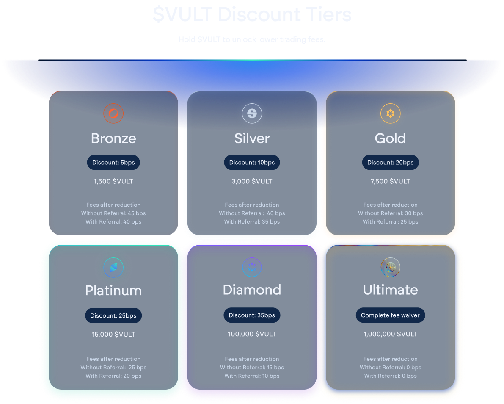

# In-App Utility

## Trading Fee Discounts

As previously mentioned, utilizing the cross-chain swap functionality of Vultisig incurs a 50-bps fee for each swap executed.&#x20;

Hold the $VULT token in the Vultisig Vaults to obtain in-app swap fee reductions and different tiers of discounts, rewarding stronger believers.

\
The Tiers are the following:

* Bronze: 1,500 [$VULT](https://x.com/search?q=%24VULT\&src=cashtag_click)= 5 bps
* Silver: 3,000 [$VULT](https://x.com/search?q=%24VULT\&src=cashtag_click)= 10 bps
* Gold: 7,500 [$VULT](https://x.com/search?q=%24VULT\&src=cashtag_click)= 20 bps
* Platinum: 15,000 [$VULT](https://x.com/search?q=%24VULT\&src=cashtag_click)= 25 bps
* Diamond: 100,000 [$VULT](https://x.com/search?q=%24VULT\&src=cashtag_click)=35 bps
* Ultimate: 1,000,000 [$VULT](https://x.com/search?q=%24VULT\&src=cashtag_click)= Complete Vultisig fee waive, will also clear referral.

<figure><figcaption></figcaption></figure>

## Holding a THORGuard NFT

Holding a [@THORGuards](https://x.com/@THORGuards) NFT ([https://opensea.io/collection/thorguards](https://opensea.io/collection/thorguards)) in your Vault will increase the discount tier by one!&#x20;

Example:

Hold 1,500 $VULT to be eligable for the Bronze Discount Tier. If you hold at least 1 THORGuard NFT you will automatically be upgraded to Silver Discount Tier.

_This is only be applicable up until Platinum Tier._
