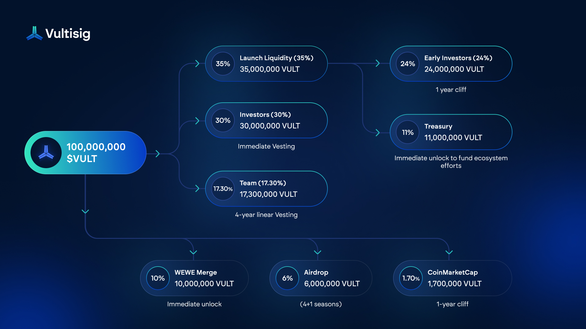

# The $VULT Token

## Token Info

Ticker: `$VULT`

Network: Ethereum; ERC-20

Contract Address: [`0xb788144DF611029C60b859DF47e79B7726C4DEBa`](https://etherscan.io/token/0xb788144df611029c60b859df47e79b7726c4deba?a=0x57f80f1ff0e9a3571c343ca623c53124f4f0f5fe)

Token Supply: 100,000,000

Availability:

* DEX: Uniswap
* CEX: Kraken

***

## Utility of $VULT token

The main benefit lies in the various mechanisms provided, through which $VULT holders receive discounts and other benefits for holding $VULT.

In general, VULT will unlock trading fee discounts, voting rights, preferential pricing, and exclusive access to premium features across the Vultisig marketplace. As our ecosystem grows, the utility and value of holding VULT tokens will increase as well.

All current and future utility is aimed at driving value to the VULT token, displaying the project's current adoption and value accrual.

The Utility is separated into 3 pillars:

* In-App Utility
* App Store Utility
* Governance Utility

***

### Value Accrual

All value generated in the Vultisig ecosystem is designed to flow back into the $VULT token, this consists mainly of fee revenue and other income streams.

<table><thead><tr><th width="373">Fee</th><th>Amount</th></tr></thead><tbody><tr><td>Swap Fees (Cross-chain and Token swaps)</td><td>Starting at 50 basis points</td></tr><tr><td>Bridge Fees (Between EVMs and IBC, to be implemented)</td><td>10 basis points</td></tr><tr><td>Marketplace Fees (Plugins and Ai Agents)</td><td>30% of generated revenue</td></tr></tbody></table>

***

### Token Buybacks

All fees generated by Vultisig products will be used to buy back $VULT tokens periodically.

This reduces the circulating supply and has a direct positive impact on the token itself depending on the adoption and usage of Vultisig products, like the apps and the app store.

The bought back [$VULT](https://x.com/search?q=%24VULT\&src=cashtag_click) tokens will be held in the fee treasury until the distribution mechanism are determined and set in place.

***

## The $VULT Tokenomics

### Allocations

<figure><figcaption>
Allocations
</figcaption></figure>

## Vesting

Following vestings apply to above mentioned parties:

<figure><figcaption></figcaption></figure>

### **Launch Liquidity Allocation:**

* 24% of $VULT tokens are allocated to initial investors as an LP position, with a 1-year cliff to provide sufficient initial liquidity
* Up to 11% of $VULT tokens come from the project treasury to add sufficient liquidity and will be carefully managed for specific growth initiatives but intended to stay in the LP.


The Treasury allocation remains partially unlocked to fund exceptional opportunities that drive Vultisig adoption, including strategic partnerships, community giveaways, and hackathons.\
All Treasury token usage will be strictly limited to initiatives that directly increase Vultisig ecosystem value.


### **Token Allocation**

#### **Community and Strategic Allocations:**

* 6% of VULT reserved for community airdrop, rewarding early supporters. Unlocking with ending seasons and distributed to airdrop participants.
* 10% of $VULT dedicated to the $WEWE → $VULT merger.
* 1.7% of $VULT allocated to a strategic partnership with CoinMarketCap to significantly expand Vultisig’s reach and adoption. Locked with a 1-year cliff.

#### **Team Commitment:**

* 17.3% of VULT allocated to the team with a 4-year linear vesting schedule, ensuring long-term alignment with project success

#### **Early Investor Structure:**

* 30% of $VULT distributed to early investors who fulfilled all their obligations by providing crucial funding that enables 3+ years of development runway and will be unlocked on launch.
* These investors initially bought in at a $70M fully diluted valuation (FDV), while the public launch begins at just $3M FDV, creating strong incentive alignment with the community
* Many investors have committed to providing additional liquidity at launch, helping stabilize price action and deepen the trading pool


You can view the full token unlock timeline on [CoinMarketCap](https://coinmarketcap.com/currencies/vultisig/#token_unlocks), which provides a detailed breakdown of vesting schedules and circulating supply.

