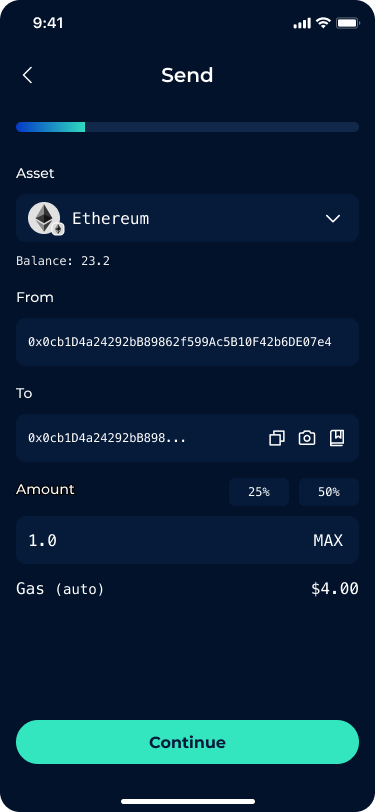
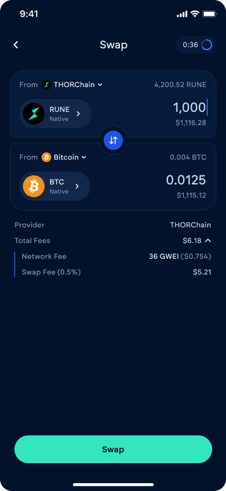
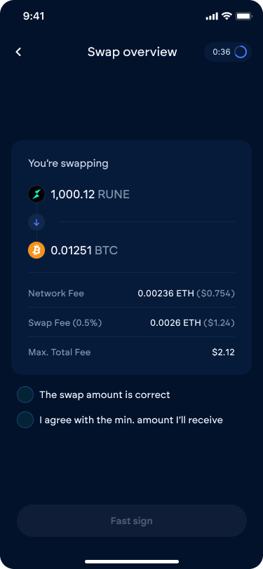
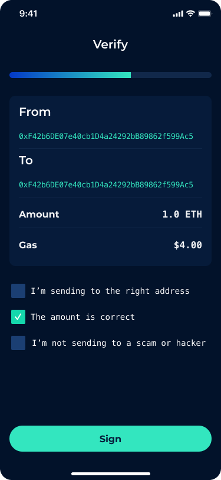
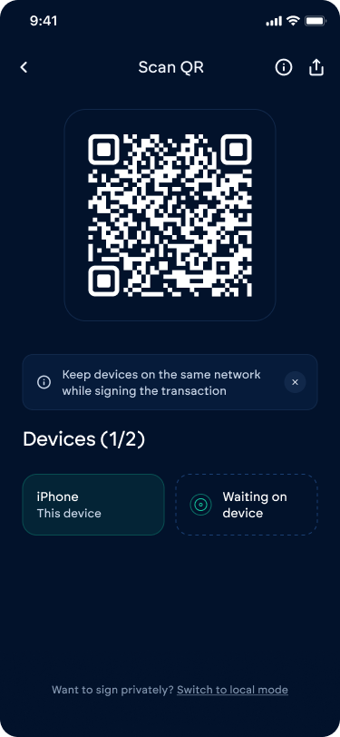
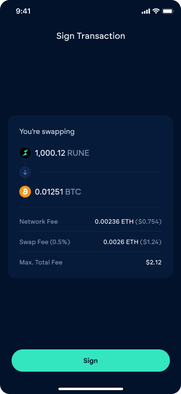
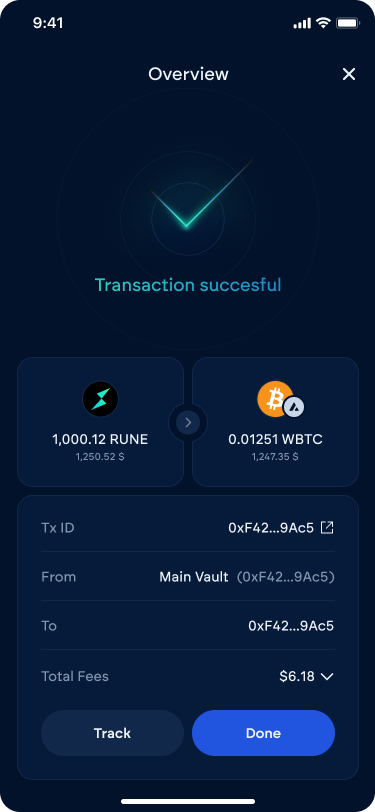

# Signing a Transaction

## Fast Vault

#### Main Device

Follow the Sending or Signing flow, prepare the transaction with input all the needed values and press **Continue** or **Swap**

<figure><figcaption>
Send screen
</figcaption></figure> <figure><figcaption>
Swap screen
</figcaption></figure>

#### Verify your input

<figure><figcaption>
Send
</figcaption></figure> <figure><figcaption>
Swap
</figcaption></figure>

Put in your password and wait until the signing is finished

<figure><figcaption></figcaption></figure>

## Secure Vault

### Get your device's ready

Depending on your Vault type (2-of-2, 2-of-3, 3-of-4, or m-of-n), you need to have the threshold number of devices ready for the signing process.


Remember: One device is creating the transaction, and the other devices are your "verification" devices. You need to "pair" the devices to each other to exchange the transaction information.

Make sure you confirm the transaction on your pair device.

Both devices will co-sign and send the final transaction. Only one transaction will be sent (you won't have duplicate transactions).


_Click on the above image to watch an explanation video on Twitter_

### Main Device

On your Main Device, prepare the transaction (e.g. Send or Swap). When ready, click on **Continue** or **Swap**.

<figure><figcaption>
Send Screen
</figcaption></figure> <figure><figcaption>
Swap screen
</figcaption></figure>

Confirm all the details on the Verify screen, check all boxes for the reminder messages, and click **Sign**.

<figure><figcaption></figcaption></figure> <figure><figcaption></figcaption></figure>

On the initiating device a QR code will be generated.


If you want to sign locally without using the Vultisig Relay server, select &#x4C;_&#x6F;cal mode_


<figure><figcaption></figcaption></figure>

### Pair Device

On your other device, after selecting the same Vault, click the **Camera** icon and scan the QR code shown on the first device.

<figure><figcaption></figcaption></figure>

The transaction details will load, verify them and click **Join key sign** to proceed.

<figure><figcaption></figcaption></figure> <figure><figcaption></figcaption></figure>

The signing will automatically start when the Threshold of devices joined.

That's it! The transaction should sign and be sent by one of the devices.

<figure><figcaption></figcaption></figure>
