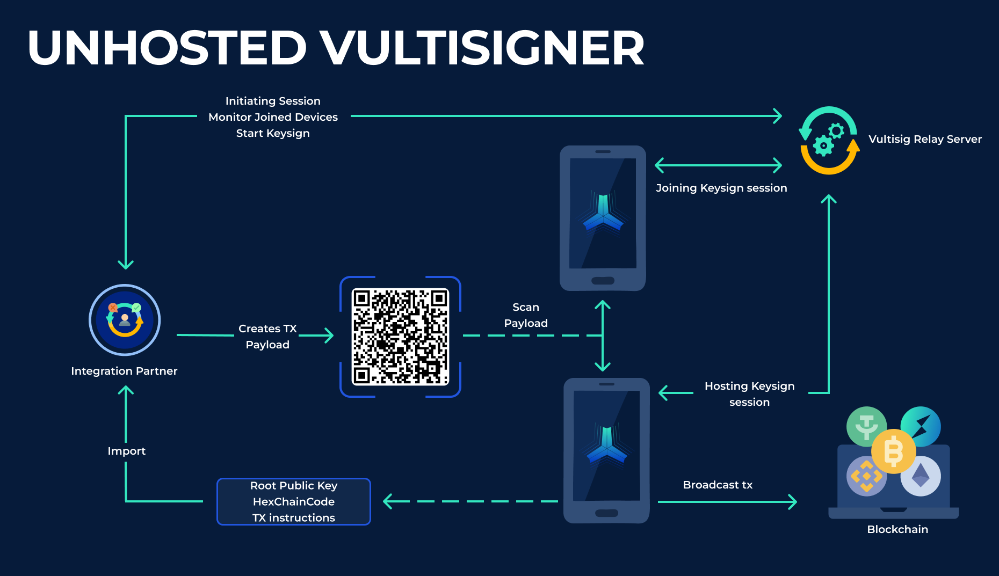

# Unhosted Vultisigner

### How the unhosted Vultisigner works

If the user already has a Vault on their devices and the interfaces want to allow the user to interact with their dApp without creating a dedicated Vault for the application, they can opt for this version.

<figure><figcaption>
Flowchart - Unhosted
</figcaption></figure>

***

### Keysign process

To facilitate this, the user only shares or respectively the interface imports, their root public key and the associated hex chain code.

The interface then uses these to derive a sub-public key via unhardened derivation, ensuring compatibility with different application possibilities.

To interact with a dApp, such as signing a transaction, the interface constructs the transaction payload based on the derived public key and the user's specific instructions and parameters.&#x20;

This keysign payload is then encoded into a QR code, allowing for seamless scanning and verification by the user's device. The QR code contains the necessary information to initiate a keysign ceremony, including the session ID and transaction payload, which is then sent to the blockchain once signed.

While the QR code is displayed, the interface sends an instruction to the Vultisig relay server to initiate a session and monitor the connected devices.&#x20;

When the user scans the QR code, the Vultisig app on the user's device joins the keysigning session. Once the threshold number of devices is present, the integration partner initiates the keysigning ceremony on the Vultisig relay server.

Upon completion of the keysigning process, the devices broadcast the transaction to the blockchain, where the integration partner can observe and display the relevant information in their application.

***

### Benefits of Unhosted Vultisigner

This approach enhances security while providing users with the flexibility to interact with different decentralized applications without having to create a vault with each interface.&#x20;

Interfaces can use Vultisigner without hosting it on their own servers or infrastructure, reducing both cost and operational responsibility.

\

\
